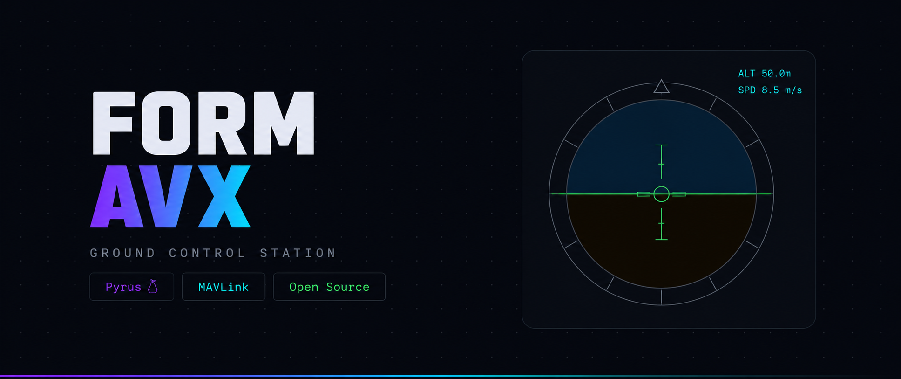
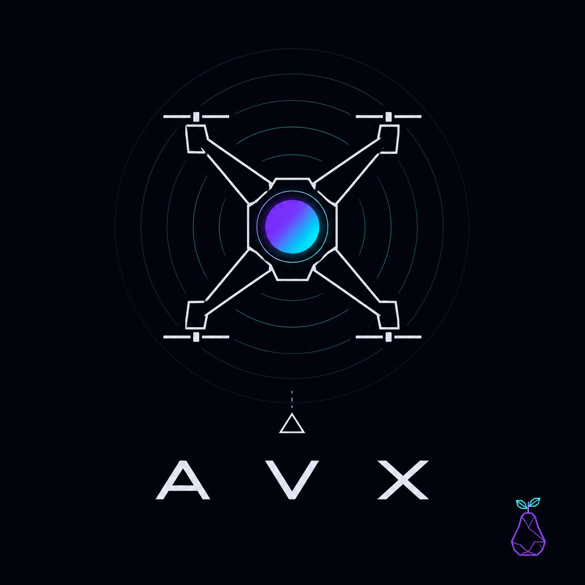

# 🛸 FORM AVX

**Ground Control Station para drones — feita em Pyrus 🍐**

[](https://github.com/AAD-Systems/FORM-AVX)
[](https://github.com/AAD-Systems/pyrus)
[](https://github.com/AAD-Systems/FORM-AVX)
[](LICENSE)



<p align="center">
  <a href="https://aad-systems.github.io/FORM-AVX/">
    
  </a>
</p>

---

## 📝 Sobre

FORM AVX é uma Ground Control Station (GCS) tática construída do zero sobre a linguagem **Pyrus**. Leve, modular e projetada para rodar no **Termux** sem dependências pesadas.

---

## ⚡ Funcionalidades

| Recurso | Descrição |
| :--- | :--- |
| 📡 **MAVLink** | Telemetria via UDP ou Serial em tempo real |
| 🗂️ **Logs binários** | Formato `.avx-stream`, 64 bytes por registro, acesso $O(1)$ |
| 🎮 **HUD** | Horizonte artificial, altitude, velocidade, heading |
| 🗺️ **Mapa tático** | OpenStreetMap com trilha de voo |
| ⏪ **Replay** | Reprodução de voos gravados |
| 🧩 **Plugins** | Extensível via arquivos `.pyu` |
| 🚁 **Simulador** | Desenvolva sem hardware real |

---

## 📦 Instalação

### Requisitos
* Python 3.8 ou superior
* Git

### Comandos padrão
```bash
git clone [https://github.com/AAD-Systems/FORM-AVX](https://github.com/AAD-Systems/FORM-AVX)
cd FORM-AVX
python avx.py --mode sim --headless

```
### Interface gráfica (Opcional)
```bash
pip install PyQt6
python avx.py --mode sim

```
### No Termux
```bash
pkg install python git
git clone [https://github.com/AAD-Systems/FORM-AVX](https://github.com/AAD-Systems/FORM-AVX)
cd FORM-AVX
python avx.py --mode sim --headless

```
## 🚀 Como Usar
### Modo Comando
| Cenário | Comando |
|---|---|
| **Simulador com UI** | python avx.py --mode sim |
| **Simulador sem UI** | python avx.py --mode sim --headless |
| **Drone real (UDP)** | python avx.py --mode live |
| **Drone real (Serial)** | python avx.py --mode serial --serial /dev/ttyUSB0 |
| **Replay de voo** | python avx.py --mode replay --replay logs/voo.avx-stream |
| **Executar testes** | python avx.py test |
| **Informações do sistema** | python avx.py info |
## 📂 Estrutura do Projeto
```text
FORM-AVX/
├── avx.py                 # Ponto de entrada principal
├── core.py                # Interpretador Pyrus
├── pyrus.py               # CLI da linguagem
├── lexer.py               # Análise léxica
├── core/                  # Lógica em Pyrus
│   ├── main.pyu           # Inicialização do Core
│   ├── event_bus.pyu      # Barramento de eventos
│   ├── storage.pyu        # Gravação de logs
│   ├── mission.pyu        # Upload de waypoints
│   ├── replay.pyu         # Reprodutor de voos
│   └── plugin_loader.pyu  # Carregador de plugins
├── telemetry/             # Fontes de telemetria
│   ├── mavlink_bridge.pyu # Parser MAVLink
│   └── simulator.pyu      # Simulador de voo
├── avx_ext/               # Extensões Python
│   ├── __init__.py
│   └── avx_builtins.py    # Storage, struct, MAVLink helpers
├── ui/                    # Interface PyQt6/QML
│   ├── ui_bridge.py       # Bridge Python/QML
│   └── qml/               # Componentes QML
├── plugins/               # Plugins .pyu
├── tests/                 # Testes unitários
└── logs/                  # Logs .avx-stream

```
## 🧩 Criando um Plugin
Crie um arquivo .pyu dentro do diretório plugins/:
```c
// plugins/meu_plugin.pyu

func on_plugin_load() {
    print("[MeuPlugin] Carregado.");
}

func on_telemetry_packet(pacote) {
    if pacote["alt"] > 100.0 {
        print("[MeuPlugin] Altitude alta: " + str(pacote["alt"]) + "m");
    }
}

func on_plugin_unload() {
    print("[MeuPlugin] Descarregado.");
}

```
> 💡 **Nota:** Reinicie o Core e o plugin será carregado de maneira automática.
> 
## 📊 Formato .avx-stream
Cada registro tem exatamente **64 bytes**. Acesso estável e imediato de complexidade O(1) através do cálculo: \text{offset} = \text{indice} \times 64.
| Offset | Tipo | Campo | Descrição |
|---|---|---|---|
| 0x00 | uint64 | timestamp | Microssegundos Unix |
| 0x08 | float64 | latitude | Graus decimais WGS84 |
| 0x10 | float64 | longitude | Graus decimais WGS84 |
| 0x18 | float32 | altitude | Metros rel. decolagem |
| 0x1C | float32 | speed | m/s |
| 0x20 | float32 | pitch | Radianos |
| 0x24 | float32 | roll | Radianos |
| 0x28 | float32 | yaw | Radianos |
| 0x2C | float32 | battery_voltage | Volts |
| 0x30 | float32 | signal_quality | 0.0 a 1.0 |
| 0x34 | float32 | climb | m/s |
| 0x38 | uint8[8] | reserved | Espaço Reservado |
## 🧪 Testes
```bash
python avx.py test

```
### Saída esperada:
```text
Rodando: test_mavlink.pyu
  ✅ GPS lat Maceio
  ✅ GPS lon Maceio
  ✅ Altitude mm->m
  ✅ Tensao mV->V
  ✅ rad->grau 180°
  ✅ rad->grau -45°
  ✅ Magic byte valido
  ✅ Magic byte invalido

Rodando: test_storage.pyu
  ✅ Total de registros apos 2 gravacoes
  ✅ Registro 0 — lat
  ✅ Registro 0 — lon
  ✅ Registro 0 — alt
  ✅ Registro 0 — speed
  ✅ Registro 1 — lat
  ✅ Registro 1 — alt
  ✅ Indice fora do range retorna null
  ✅ Timestamp do registro 0
  ✅ Total apos append
  ✅ Registro 2 — lat

Arquivos OK: 2 | Com erro: 0

```
## 🏗️ Arquitetura
```text
Drone ──> MAVLink ──> Core Pyrus ──> Event Bus ──> Storage + UI

```
 * O **Core** executa de forma independente em uma thread separada.
 * A **UI** consome e renderiza os eventos através de uma queue thread-safe.
## 🗺️ Roadmap
| Versão | Recursos / Escopo | Status |
|---|---|---|
| **v0.1** | MAVLink, storage, HUD, mapa, replay | 🔨 Em desenvolvimento |
| **v0.2** | Planejador de missão, controles avançados de replay | 📋 Planejado |
| **v0.3** | Estabilização da API de plugins | 📋 Planejado |
| **v1.0** | Core engine compilado nativamente | 🎯 Meta |
## 🛠️ Tecnologias Utilizadas
 * **Pyrus v0.2.0** — Linguagem do Core Engine
 * **Python 3.8+** — Runtime do ecossistema
 * **PyQt6** — Engine de Interface gráfica (opcional)
 * **MAVLink v1** — Protocolo base de comunicação e telemetria
 * **OpenStreetMap** — Provedor de tiles para renderização do mapa
## 🤝 Contribuindo
Issues, pull requests e feedbacks construtivos são sempre bem-vindos. Testes validados em hardware MAVLink real em campo são especialmente úteis para o projeto.
## ⚖️ Licença
Distribuído sob a licença **MIT**. Sinta-se livre para usar, modificar e distribuir o código, mantendo apenas os créditos originais.
<p align="center">


Feito com 🦜 em Alagoas, Brasil. 🇧🇷🍐
</p>

> 💡 Ferramentas de drone deveriam funcionar de verdade no Termux do celular, e não apenas em um MacBook topo de linha com assinatura para absolutamente tudo.
